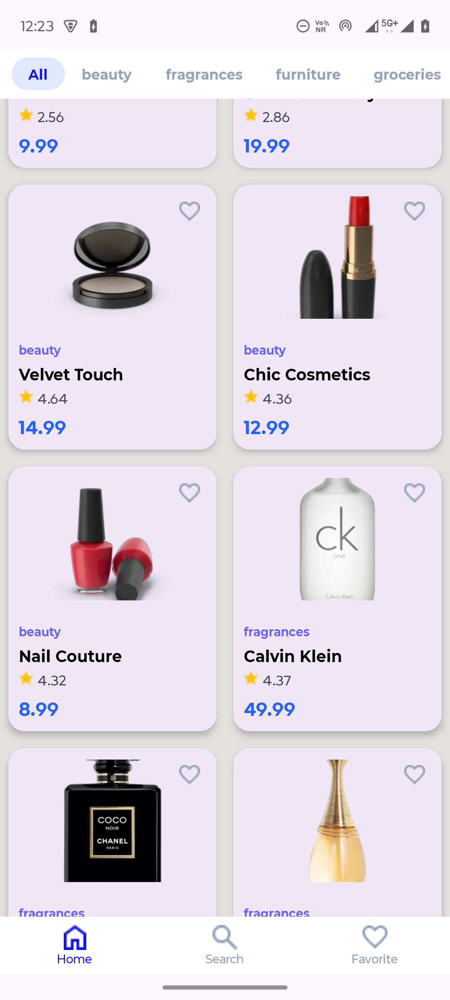
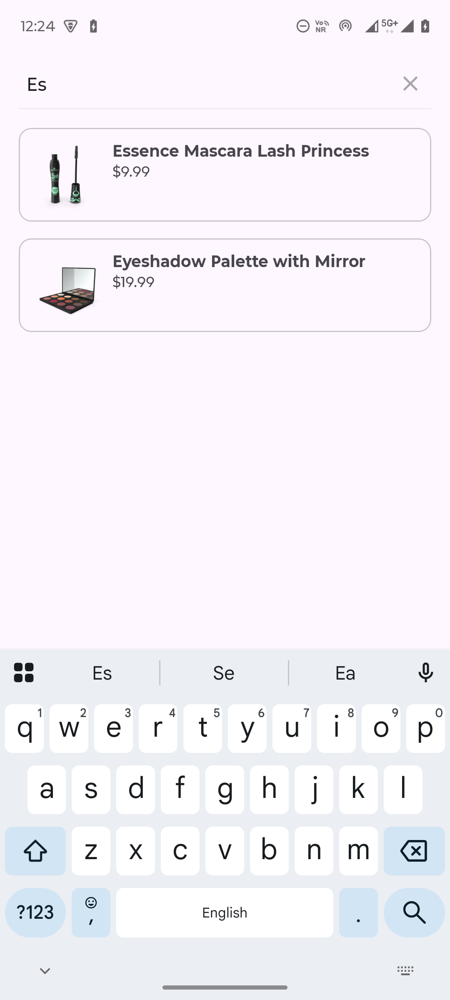

# ProductCatalogApp
Product Catalog Android App

An Android application that displays products from an API and allows users to browse categories, view product details, and save favorite products locally.

The app is built using Modern Android Development practices such as MVVM architecture, Retrofit networking, Room database, and RecyclerView for dynamic lists.

🚀 Features

Display products from a remote API

Category-based browsing using TabLayout + ViewPager2

Product details screen

Persistent favorites using Room Database

Smooth image loading with Glide

Shimmer loading effect for better user experience

Pagination / Infinite scrolling for product lists

<h2>Screenshots</h2>

  
  

